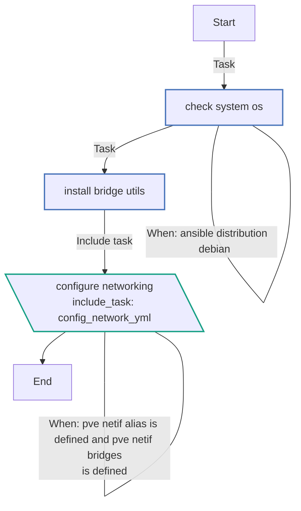
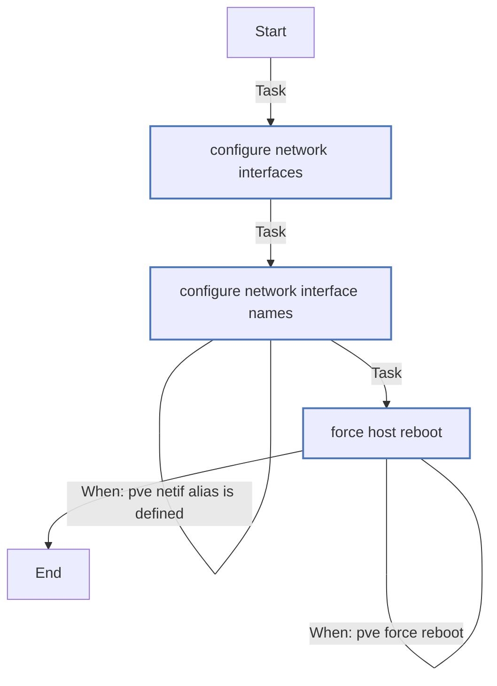
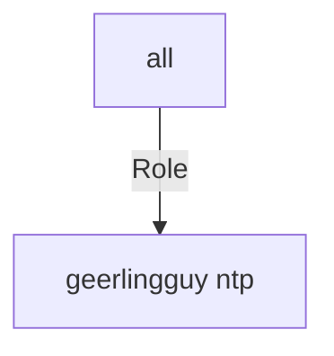

<!-- DOCSIBLE START -->

# 📃 Role overview

## tmueller.pvenetconf


Description: Configure Network for Proxmox VE-Cluster


| Field                | Value           |
|--------------------- |-----------------|
| Readme update        | 16/07/2024 |

### Defaults

**These are static variables with lower priority**

#### File: main.yml


| Var          | Type         | Value       |Required    | Title       |
|--------------|--------------|-------------|-------------|-------------|
| [pve_force_reboot](defaults/main.yml#L2)   | bool   | `False`  |  n/a  |  n/a |


### Tasks


#### File: main.yml

| Name | Module | Has Conditions |
| ---- | ------ | --------- |
| Check system OS | ansible.builtin.fail | True |
| Install bridge-utils | ansible.builtin.apt | False |
| Configure networking | ansible.builtin.include_tasks | True |

#### File: config-network.yml

| Name | Module | Has Conditions |
| ---- | ------ | --------- |
| Configure network interfaces | ansible.builtin.template | False |
| Configure network interface names | ansible.builtin.template | True |
| Force host reboot | ansible.builtin.debug | True |


## Task Flow Graphs


### Graph for main.yml




### Graph for config-network.yml




## Playbook

```yml
# code language=ansible

- name: Update Known hosts
  ansible.builtin.import_playbook: playbooks/update_known_hosts.yaml
- name: Add sudo and sudoers
  ansible.builtin.import_playbook: playbooks/sudoers.yaml

- name: Configure NTP and Timezone
  hosts: all
  become: true
  become_method: ansible.builtin.sudo
  roles:
    - geerlingguy.ntp

- name: Setup Base OS with always wanted packages
  ansible.builtin.import_playbook: playbooks/setup_base.yaml

- name: Deploy/Configure Cluster (or single Node depend)
  ansible.builtin.import_playbook: playbooks/cluster.yaml

```
## Playbook graph


## Author Information
Tobias Müller

#### License

MIT

#### Minimum Ansible Version

2.14

#### Platforms

- **Debian**: ['bookworm', 'bullseye']
#### Thanks to
- https://github.com/exaluc/docsible

<!-- DOCSIBLE END -->
